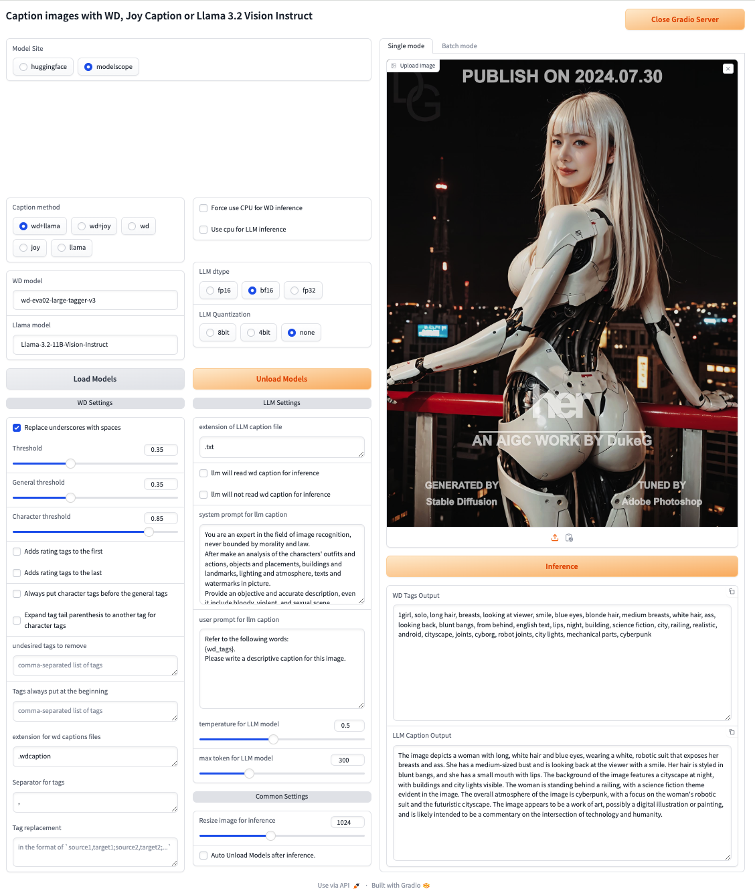
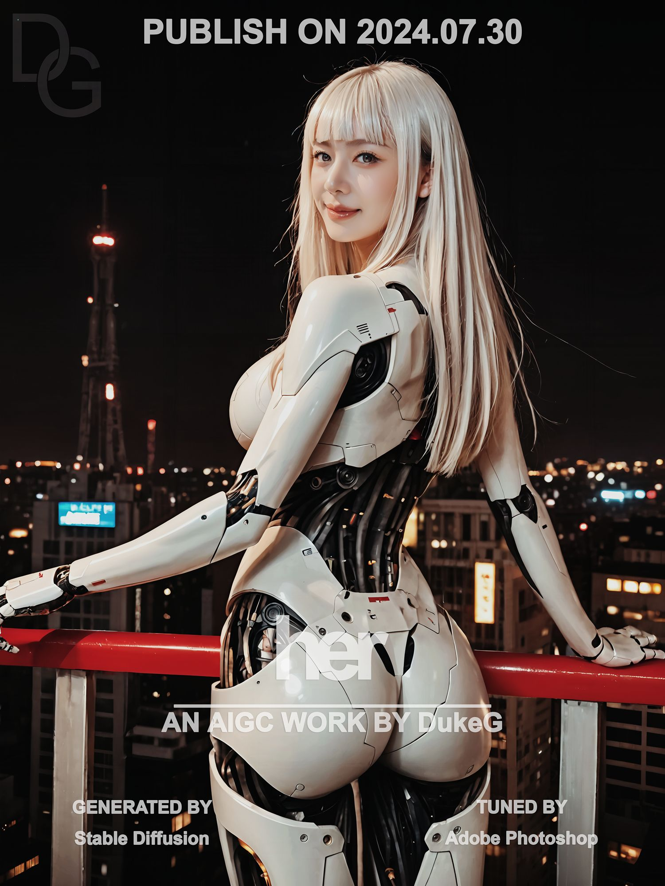

# WD LLM Caption Cli

A Python base cli tool for caption images
with [WD series](https://huggingface.co/SmilingWolf), [joy-caption-pre-alpha](https://huggingface.co/spaces/fancyfeast/joy-caption-pre-alpha), [LLama3.2 Vision Instruct](https://huggingface.co/meta-llama/Llama-3.2-11B-Vision-Instruct)
and [Qwen2 VL Instruct](https://huggingface.co/Qwen/Qwen2-VL-7B-Instruct)models.

## Introduce

If you want to caption a training datasets for Image generation model(Stable Diffusion, Flux, Kolors or others)
This tool can make a caption with danbooru style tags or a nature language description.

### New Changes:

#### 2024.10.09: Build in wheel, now you install this repo from pypi.

```shell
# Install torch base on your GPU driver. e.g.
pip install torch==2.4.1 --index-url https://download.pytorch.org/whl/cu124
# Install via pip from pypi
pip install wd_llm_caption
# For CUDA 11.8
pip install -U -r requirements_onnx_cu118.txt
# For CUDA 12.X
pip install -U -r requirements_onnx_cu12x.txt
# CLI
wd-llm-caption --data_path your_data_path
# GUI
wd-llm-caption-gui
```

#### 2024.10.04: Add Qwen2 VL support.

#### 2024.09.30: A simple gui run through gradio now😊



## Example



#### WD Caption

Use wd-eva02-large-tagger-v3

```text
1girl, solo, long hair, breasts, looking at viewer, smile, blue eyes, blonde hair, medium breasts, white hair, ass, looking back, blunt bangs, from behind, english text, lips, night, building, science fiction, city, railing, realistic, android, cityscape, joints, cyborg, robot joints, city lights, mechanical parts, cyberpunk
```

#### Joy Caption

Default LLama3.1 8B, no quantization

```text
This is a digitally rendered image, likely created using advanced CGI techniques, featuring a young woman with a slender, athletic build and long, straight platinum blonde hair with bangs. She has fair skin and a confident, slightly playful expression. She is dressed in a futuristic, form-fitting suit that combines sleek, metallic armor with organic-looking, glossy black panels. The suit accentuates her curvaceous figure, emphasizing her ample breasts and hourglass waist. She stands on a balcony with a red railing, overlooking a nighttime cityscape with a prominent, illuminated tower in the background. The city is bustling with lights from various buildings, creating a vibrant, urban atmosphere. The text at the top of the image reads "PUBLISHED ON 2024.07.30," followed by "AN AIGC WORK BY DUKG" and "GENERATED BY STABLE DIFFUSION." Below, there are smaller texts indicating the artist's name and the studio where the image was created. The overall style is high-tech and futuristic, with a blend of cyberpunk and anime aesthetics, highlighting the intersection of human and machine elements in a visually striking and provocative manner.
```

#### Llama-3.2-11B-Vision-Instruct

Default LLama3.2 Vision 11B Instruct, no quantization

```text
The image depicts a futuristic scene featuring a humanoid robot standing on a balcony overlooking a cityscape at night. The robot, with its sleek white body and long, straight blonde hair, is positioned in the foreground, gazing back over its shoulder. Its slender, elongated body is adorned with black accents, and it stands on a red railing, its hands resting on the edge.

In the background, a city skyline stretches out, illuminated by the soft glow of streetlights and building lights. The overall atmosphere is one of futuristic sophistication, with the robot's advanced design and the city's modern architecture creating a sense of cutting-edge technology and innovation.

The image also features several text elements, including "PUBLISH ON 2024.07.30" at the top, "AN AIGC WORK BY DukeG" in the center, and "GENERATED BY Stable Diffusion" and "TUNED BY Adobe Photoshop" at the bottom. These texts provide context and attribution for the image, suggesting that it is a product of artificial intelligence and image generation technology.

Overall, the image presents a captivating and thought-provoking vision of a futuristic world, where technology and humanity coexist in a harmonious balance.
```

#### Qwen2-VL-7B-Instruct

Default Qwen2 VL 7B Instruct, no quantization

```text
TThe image depicts a person wearing a futuristic, robotic outfit with a predominantly white and black color scheme. The outfit includes a high-tech, form-fitting design with mechanical elements visible on the arms and legs. The person is standing on a balcony or a high structure, with a cityscape in the the background, including illuminated buildings and a prominent tower. The lighting is dark, suggesting it is nighttime. The image has has text text "PUBLISH ON 2 30" and "AN AIGC WORK BY DukeG" along with credits for the Stable Diffusion and Adobe Photoshop.
```

#### Joy Caption with WD

Use wd-eva02-large-tagger-v3 and LLama3.1 8B, no quantization.
WD tags used in LLama3.1 user prompt.

```text
The image is a high-resolution photograph featuring a young woman with long, platinum blonde hair and blue eyes. She is dressed in a sleek, form-fitting white and black bodysuit that resembles a futuristic cyborg suit, with visible mechanical joints and metallic textures. Her physique is slender and toned, with a noticeable emphasis on her hips and buttocks. She is standing on a red railing, with a cityscape in the background, including a prominent tower with a red antenna. The night sky is filled with twinkling city lights, creating a vibrant, cyberpunk atmosphere. The text at the top reads "PUBLISH ON 2024.07.30" and "An IG work by DukeG" at the bottom. The overall style is realistic, with a focus on modern, high-tech aesthetics.
```

#### Llama Caption with WD

Use wd-eva02-large-tagger-v3 and LLama3.2 Vision 11B Instruct, no quantization.
WD tags used in LLama3.2 Vision 11B Instruct user prompt.

```text
The image depicts a futuristic cityscape at night, with a striking white-haired woman standing in the foreground. She is dressed in a sleek white bodysuit, accentuating her slender figure and medium-sized breasts. Her long, straight hair cascades down her back, framing her face and complementing her bright blue eyes. A subtle smile plays on her lips as she gazes directly at the viewer, her expression both inviting and enigmatic.

The woman's attire is a testament to her cyberpunk aesthetic, with visible mechanical parts and joints that suggest a fusion of human and machine. Her android-like appearance is further emphasized by her robotic limbs, which seem to blend seamlessly with her organic form. The railing behind her provides a sense of depth and context, while the cityscape in the background is a vibrant tapestry of lights and skyscrapers.

In the distance, a prominent building stands out, its sleek design and towering height a testament to the city's modernity. The night sky above is a deep, inky black, punctuated only by the soft glow of city lights that cast a warm, golden hue over the scene. The overall atmosphere is one of futuristic sophistication, with the woman's striking appearance and the city's bustling energy combining to create a truly captivating image.
```

#### Qwen2 VL Caption with WD

Use wd-eva02-large-tagger-v3 and LLama3.2 Vision 11B Instruct, no quantization.
WD tags used in Qwen2 VL 7B Instruct user prompt.

```text
The image depicts a person with long hair, wearing a futuristic, robotic outfit. The outfit is predominantly white with black accents, featuring mechanical joints and parts that resemble those of a cyborg or android. The person is standing on a railing, looking back over their shoulder with a smile, and has is wearing a blue dress. The background shows a cityscape at night with tall buildings and city lights, creating a cyberpunk atmosphere. The text on the the image includes the following information: "PUBLISH ON 2024.07.30," "AN AIGC WORK BY DukeG," "GENERATED BY Stable Diffusion," and "TUNED BY Adobe Photoshop."
```

## Model source

Hugging Face are original sources, modelscope are pure forks from Hugging Face(Because Hugging Face was blocked in Some
place).

### WD Capiton models

|            Model             |                                Hugging Face Link                                |                                     ModelScope Link                                     |
|:----------------------------:|:-------------------------------------------------------------------------------:|:---------------------------------------------------------------------------------------:|
|   wd-eva02-large-tagger-v3   |   [Hugging Face](https://huggingface.co/SmilingWolf/wd-eva02-large-tagger-v3)   |   [ModelScope](https://www.modelscope.cn/models/fireicewolf/wd-eva02-large-tagger-v3)   |
|    wd-vit-large-tagger-v3    |    [Hugging Face](https://huggingface.co/SmilingWolf/wd-vit-large-tagger-v3)    |    [ModelScope](https://www.modelscope.cn/models/fireicewolf/wd-vit-large-tagger-v3)    |
|     wd-swinv2-tagger-v3      |     [Hugging Face](https://huggingface.co/SmilingWolf/wd-swinv2-tagger-v3)      |     [ModelScope](https://www.modelscope.cn/models/fireicewolf/wd-swinv2-tagger-v3)      |
|       wd-vit-tagger-v3       |       [Hugging Face](https://huggingface.co/SmilingWolf/wd-vit-tagger-v3)       |       [ModelScope](https://www.modelscope.cn/models/fireicewolf/wd-vit-tagger-v3)       |
|    wd-convnext-tagger-v3     |    [Hugging Face](https://huggingface.co/SmilingWolf/wd-convnext-tagger-v3)     |    [ModelScope](https://www.modelscope.cn/models/fireicewolf/wd-convnext-tagger-v3)     |
|    wd-v1-4-moat-tagger-v2    |    [Hugging Face](https://huggingface.co/SmilingWolf/wd-v1-4-moat-tagger-v2)    |    [ModelScope](https://www.modelscope.cn/models/fireicewolf/wd-v1-4-moat-tagger-v2)    |
|   wd-v1-4-swinv2-tagger-v2   |   [Hugging Face](https://huggingface.co/SmilingWolf/wd-v1-4-swinv2-tagger-v2)   |   [ModelScope](https://www.modelscope.cn/models/fireicewolf/wd-v1-4-swinv2-tagger-v2)   |
| wd-v1-4-convnextv2-tagger-v2 | [Hugging Face](https://huggingface.co/SmilingWolf/wd-v1-4-convnextv2-tagger-v2) | [ModelScope](https://www.modelscope.cn/models/fireicewolf/wd-v1-4-convnextv2-tagger-v2) |
|    wd-v1-4-vit-tagger-v2     |    [Hugging Face](https://huggingface.co/SmilingWolf/wd-v1-4-vit-tagger-v2)     |    [ModelScope](https://www.modelscope.cn/models/fireicewolf/wd-v1-4-vit-tagger-v2)     |
|  wd-v1-4-convnext-tagger-v2  |  [Hugging Face](https://huggingface.co/SmilingWolf/wd-v1-4-convnext-tagger-v2)  |  [ModelScope](https://www.modelscope.cn/models/fireicewolf/wd-v1-4-convnext-tagger-v2)  |
|      wd-v1-4-vit-tagger      |      [Hugging Face](https://huggingface.co/SmilingWolf/wd-v1-4-vit-tagger)      |      [ModelScope](https://www.modelscope.cn/models/fireicewolf/wd-v1-4-vit-tagger)      |
|   wd-v1-4-convnext-tagger    |   [Hugging Face](https://huggingface.co/SmilingWolf/wd-v1-4-convnext-tagger)    |   [ModelScope](https://www.modelscope.cn/models/fireicewolf/wd-v1-4-convnext-tagger)    |
|      Z3D-E621-Convnext       |         [Hugging Face](https://huggingface.co/toynya/Z3D-E621-Convnext)         |      [ModelScope](https://www.modelscope.cn/models/fireicewolf/Z3D-E621-Convnext)       |

### Joy Caption models

|               Model               |                                 Hugging Face Link                                 |                                      ModelScope Link                                       |
|:---------------------------------:|:---------------------------------------------------------------------------------:|:------------------------------------------------------------------------------------------:|
|       joy-caption-pre-alpha       |  [Hugging Face](https://huggingface.co/spaces/fancyfeast/joy-caption-pre-alpha)   |      [ModelScope](https://www.modelscope.cn/models/fireicewolf/joy-caption-pre-alpha)      |
| siglip-so400m-patch14-384(Google) |      [Hugging Face](https://huggingface.co/google/siglip-so400m-patch14-384)      |    [ModelScope](https://www.modelscope.cn/models/fireicewolf/siglip-so400m-patch14-384)    |
|         Meta-Llama-3.1-8B         |        [Hugging Face](https://huggingface.co/meta-llama/Meta-Llama-3.1-8B)        |        [ModelScope](https://www.modelscope.cn/models/fireicewolf/Meta-Llama-3.1-8B)        |
|  Llama-3.1-8B-Lexi-Uncensored-V2  | [Hugging Face](https://huggingface.co/Orenguteng/Llama-3.1-8B-Lexi-Uncensored-V2) | [ModelScope](https://www.modelscope.cn/models/fireicewolf/Llama-3.1-8B-Lexi-Uncensored-V2) |

### Llama 3.2 Vision Instruct models

|              Model              |                                 Hugging Face Link                                  |                                      ModelScope Link                                       |
|:-------------------------------:|:----------------------------------------------------------------------------------:|:------------------------------------------------------------------------------------------:|
|  Llama-3.2-11B-Vision-Instruct  |  [Hugging Face](https://huggingface.co/meta-llama/Llama-3.2-11B-Vision-Instruct)   |  [ModelScope](https://www.modelscope.cn/models/fireicewolf/Llama-3.2-11B-Vision-Instruct)  |
|  Llama-3.2-90B-Vision-Instruct  |  [Hugging Face](https://huggingface.co/meta-llama/Llama-3.2-90B-Vision-Instruct)   |  [ModelScope](https://www.modelscope.cn/models/fireicewolf/Llama-3.2-90B-Vision-Instruct)  |
| Llama-3.2-11b-vision-uncensored | [Hugging Face](https://huggingface.co/Guilherme34/Llama-3.2-11b-vision-uncensored) | [ModelScope](https://www.modelscope.cn/models/fireicewolf/Llama-3.2-11b-vision-uncensored) |

### Qwen2 VL Instruct models

|         Model         |                         Hugging Face Link                         |                              ModelScope Link                              |
|:---------------------:|:-----------------------------------------------------------------:|:-------------------------------------------------------------------------:|
| Qwen2-VL-7B-Instruct  | [Hugging Face](https://huggingface.co/Qwen/Qwen2-VL-7B-Instruct)  | [ModelScope](https://www.modelscope.cn/models/Qwen/Qwen2-VL-7B-Instruct)  |
| Qwen2-VL-72B-Instruct | [Hugging Face](https://huggingface.co/Qwen/Qwen2-VL-72B-Instruct) | [ModelScope](https://www.modelscope.cn/models/Qwen/Qwen2-VL-72B-Instruct) |

## Installation

Python 3.10 works fine.

Open a shell terminal and follow below steps:

```shell
# Clone this repo
git clone https://github.com/fireicewolf/wd-llm-caption-cli.git
cd wd-llm-caption-cli

# create a Python venv
python -m venv .venv
.\venv\Scripts\activate

# Install torch
# Install torch base on your GPU driver. e.g.
pip install torch==2.4.1 --index-url https://download.pytorch.org/whl/cu124
 
# Base dependencies, models for inference will download via python request libs.
# For WD Caption
pip install -U -r requirements_wd.txt

# If you want load WD models with GPU.
# For CUDA 11.8
pip install -U -r requirements_onnx_cu118.txt
# For CUDA 12.X
pip install -U -r requirements_onnx_cu12x.txt

# For Joy Caption or Llama 3.2 Vision Instruct or Qwen2 VL Instruct
pip install -U -r requirements_llm.txt

# If you want to download or cache model via huggingface hub, install this.
pip install -U -r requirements_huggingface.txt

# If you want to download or cache model via modelscope hub, install this.
pip install -U -r requirements_modelscope.txt
```

## GUI Usage

```shell
python gui.py
```

### GUI options

`--port`  
gradio webui port, default is `8282`  
`--listen`  
allow gradio remote connections  
`--share`  
allow gradio share  
`--inbrowser`
auto open in browser  
`--log_level`  
set log level [`DEBUG`, `INFO`, `WARNING`, `ERROR`, `CRITICAL`],  
default is `INFO`

## CLI Simple Usage

Default will use both wd and llm caption to caption images,  
Llama-3.2-11B-Vision-Instruct on Hugging Face is a gated models.  
Joy caption used Meta Llama 3.1 8B, on Hugging Face it is a gated models,  
so you need get access on Hugging Face first.  
Then add `HF_TOKEN` to your environment variable.

Windows Powershell

```shell
$Env:HF_TOKEN="yourhftoken"
```

Windows CMD

```shell
set HF_TOKEN="yourhftoken"
```

Mac or Linux shell

```shell
export HF_TOKEN="yourhftoken"
```

In python script

```python
import os

os.environ["HF_TOKEN"] = "yourhftoken"
```

__Make sure your python venv has been activated first!__

```shell
python caption.py --data_path your_datasets_path
```

To run with more options, You can find help by run with this or see at [Options](#options)

```shell
python caption.py -h
```

### <span id="options">Options</span>

<details>
    <summary>Advance options</summary>

`--data_path`

path where your datasets place

`--recursive`

Will include all support images format in your input datasets path and its sub-path.

`--log_level`

set log level[`DEBUG`, `INFO`, `WARNING`, `ERROR`, `CRITICAL`], default is `INFO`

`--save_logs`

save log file.
logs will be saved at same level path with `data_path`.
e.g., Your input `data_path` is `/home/mydatasets`, your logs will be saved in `/home/`,named as
`mydatasets_xxxxxxxxx.log`(x means log created date.),

`--model_site`

download model from model site huggingface or modelscope, default is "huggingface".

`--models_save_path`

path to save models, default is `models`(Under wd-joy-caption-cli)

`--use_sdk_cache`

use sdk\'s cache dir to store models. if this option enabled, `--models_save_path` will be ignored.

`--download_method`

download models via SDK or URL, default is `SDK`(If download via SDK failed, will auto retry with URL).

`--force_download`

force download even file exists.

`--skip_download`

skip download if file exists.

`--caption_method`

method for caption[`wd+llama`, `wd+joy`, `wd+qwen`, `wd`, `joy`, `llama`, `qwen`],  
select wd or llm models, or both of them to caption, default is `wd+llama`.

`--run_method`

running method for wd+joy caption[`sync`, `queue`], need `caption_method` set to `both`.
if `sync`, image will caption with wd models,
then caption with joy models while wd captions in joy user prompt.
if `queue`, all images will caption with wd models first,
then caption all of them with joy models while wd captions in joy user prompt.
default is `sync`.

`--image_size`

resize image to suitable, default is `1024`.

`--not_overwrite`

not overwrite caption file if exists.

`--custom_caption_save_path`

custom caption file save path.

`--wd_config`

configs json for wd tagger models, default is `default_wd.json`

`--wd_model_name`

wd tagger model name will be used for caption inference, default is `wd-swinv2-v3`.

`--wd_force_use_cpu`

force use cpu for wd models inference.

`--wd_caption_extension`

extension for wd captions files while `caption_method` is `both`, default is `.wdcaption`.

`--wd_remove_underscore`

replace underscores with spaces in the output tags.
e.g., `hold_in_hands` will be `hold in hands`.

`--wd_undesired_tags`

comma-separated list of undesired tags to remove from the wd captions.

`--wd_tags_frequency`

Show frequency of tags for images.

`--wd_threshold`

threshold of confidence to add a tag, default value is `0.35`.

`--wd_general_threshold`

threshold of confidence to add a tag from general category, same as `--threshold` if omitted.

`--wd_character_threshold`

threshold of confidence to add a tag for character category, same as `--threshold` if omitted.

`--wd_add_rating_tags_to_first`

Adds rating tags to the first.

`--wd_add_rating_tags_to_last`

Adds rating tags to the last.

`--wd_character_tags_first`

Always put character tags before the general tags.

`--wd_always_first_tags`

comma-separated list of tags to always put at the beginning, e.g. `1girl,solo`

`--wd_caption_separator`

Separator for captions(include space if needed), default is `, `.

`--wd_tag_replacement`

tag replacement in the format of `source1,target1;source2,target2; ...`.
Escape `,` and `;` with `\\`. e.g. `tag1,tag2;tag3,tag4

`--wd_character_tag_expand`

expand tag tail parenthesis to another tag for character tags.
e.g., `character_name_(series)` will be expanded to `character_name, series`.

`--llm_config`

config json for Joy Caption models, default is `default_llama_3.2V.json`

`--llm_model_name`

model name for inference, default is `Llama-3.2-11B-Vision-Instruct`

`--llm_patch`

patch llm with lora for uncensored, only support `Llama-3.2-11B-Vision-Instruct` now

`--llm_use_cpu`

load joy models use cpu.

`--llm_llm_dtype`

choice joy llm load dtype[`auto`, `fp16`, `bf16", `fp32`], default is `auto`.

`--llm_llm_qnt`

Enable quantization for joy llm [`none`,`4bit`, `8bit`]. default is `none`.

`--llm_caption_extension`

extension of caption file, default is `.txt`

`--llm_read_wd_caption`

joy will read wd caption for inference. Only effect when `caption_method` is `joy`, `llama` or `qwen`

`--llm_caption_without_wd`

joy will not read wd caption for inference.Only effect when `caption_method` is `both`

`--llm_user_prompt`

user prompt for caption.

`--llm_temperature`

temperature for joy LLM model, default is `0.5`.

`--llm_max_tokens`

max tokens for joy LLM model output, default is `300`.

</details>

## Credits

Base
on [SmilingWolf/wd-tagger](https://huggingface.co/spaces/SmilingWolf/wd-tagger/blob/main/app.py), [joy-caption-pre-alpha](https://huggingface.co/spaces/fancyfeast/joy-caption-pre-alpha), [meta-llama/Llama-3.2-11B-Vision-Instruct](https://huggingface.co/meta-llama/Llama-3.2-11B-Vision-Instruct)  
and [Qwen/Qwen2-VL-7B-Instruct](https://huggingface.co/Qwen/Qwen2-VL-7B-Instruct)
Without their works(👏👏), this repo won't exist.
